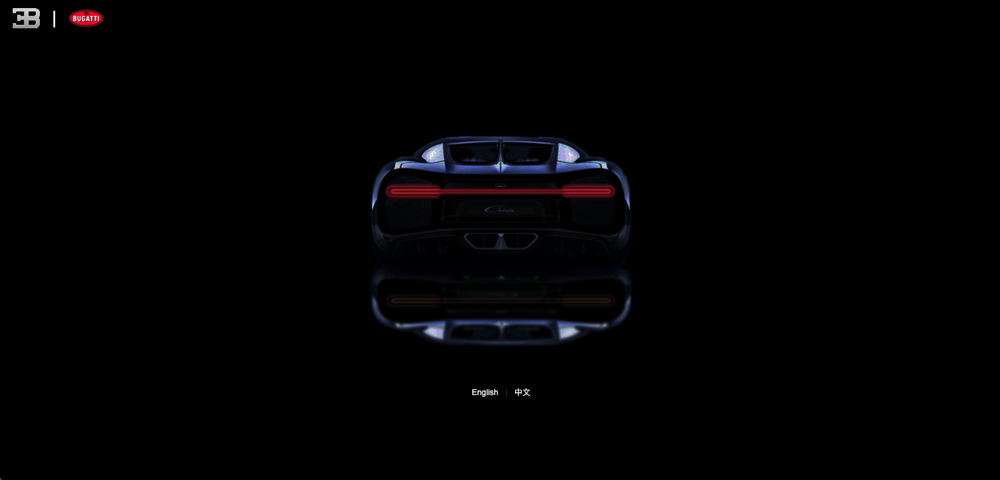
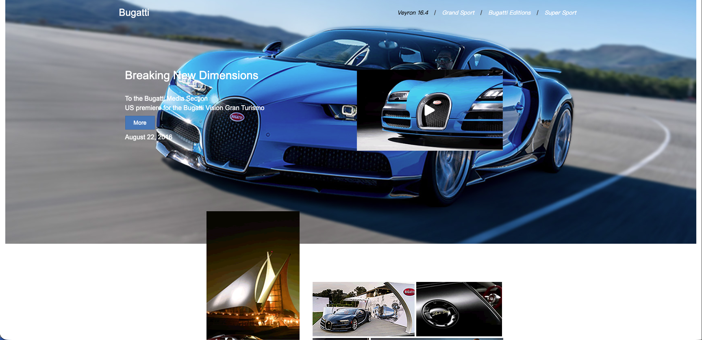

# Bugatti Brand Demo Site

A static frontend practice website inspired by the Bugatti brand, featuring UI design and front-end effects.

## Preview





## Pages

| Page | Description |
|---|---|
| `index.html` | Splash landing page with animated car headlamps and background audio |
| `home.html` | Main homepage with navbar, image gallery, and video modal |
| `prodact.html` | Product detail page with full-screen panel sections and side navigation |

## Tech Stack

- HTML / CSS
- Bootstrap 3
- jQuery 3.0.0
- jPlayer — background audio playback
- BlackBox — modal overlay
- WOW.js + Animate.css — scroll-triggered animations

## Usage

No build step required. Open any `.html` file directly in a browser.

```
open index.html
```

## Author

Z-lion — frontend practice project, 2016
